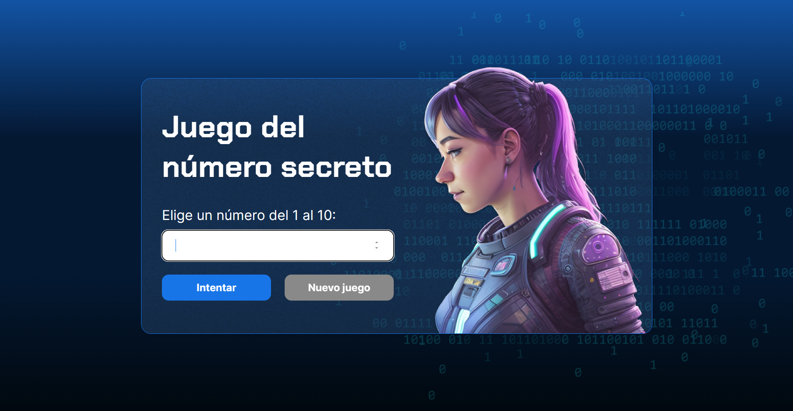

# Juego de Adivinanza de Números

Este repositorio alberga el código fuente de mi primera página web, donde me he centrado en el desarrollo de la lógica del programa utilizando JavaScript. La página implementa un juego interactivo de adivinanza de números, realizado en los cursos de Alura LATAM:

- [Lógica de Programación: sumérgete en la programación con JavaScript](https://www.aluracursos.com/curso-online-logica-programacion-sumergete-programacion-javascript)
- [Lógica de Programación: Explorar Funciones y Listas](https://www.aluracursos.com/curso-online-logica-programacion-explorar-funciones-listas)

## Características Principales

- Implementación de lógica de juego en JavaScript.
- Interfaz web simple con HTML y estilos básicos con CSS, proporcionada por Alura LATAM.
- Uso de funciones para manejar la generación de números y la verificación de intentos.
- Integración de eventos de teclado para una experiencia de juego mejorada, empleada de manera personal.

## Estructura del Proyecto

1. `index.html`: Archivo principal de la página web.
2. `style.css`: Estilos básicos para mejorar la presentación.
3. `app.js`: Código JavaScript que impulsa la lógica del juego.
4. `img`: Carpeta con las imágenes utilizadas para la interfaz gráfica.
5. `LICENSE.md`: Licencia MIT.
6. `screenshots`: Carpeta con las capturas de pantalla del juego.

## Instrucciones de Juego

- Selecciona un número dentro de un rango establecido.
- Utiliza funciones de JavaScript para interactuar con la interfaz.
- Intenta adivinar el número secreto en la menor cantidad de intentos posible.

## Notas Adicionales

Este proyecto fue desarrollado como parte de mi aprendizaje en los cursos de Alura LATAM. El código incluye funciones y estructuras lógicas clave para comprender el desarrollo web con JavaScript.

## Licencia

Este proyecto está bajo la [licencia MIT](LICENSE.md).

## Capturas de Pantalla

Aquí hay una vista previa visual del juego:

## Instalación y Ejecución

1. Clona este repositorio: `git clone https://github.com/LuisMarioB5/juego-numero-secreto.git`
2. Abre el archivo `index.html` en tu navegador web.

## Recursos Externos

- Cursos de Alura LATAM:
  1. [Lógica de Programación sumérgete en la programación con JavaScript](https://www.aluracursos.com/curso-online-logica-programacion-sumergete-programacion-javascript)
  2. [Lógica de programación: explorar funciones y listas](https://www.aluracursos.com/curso-online-logica-programacion-explorar-funciones-listas)
 
- Implementación de los eventos de teclado:
  1. [Element: keypress event](https://developer.mozilla.org/en-US/docs/Web/API/Element/keypress_event)
  2. [Element: evento keydown](https://developer.mozilla.org/es/docs/Web/API/Element/keydown_event)
